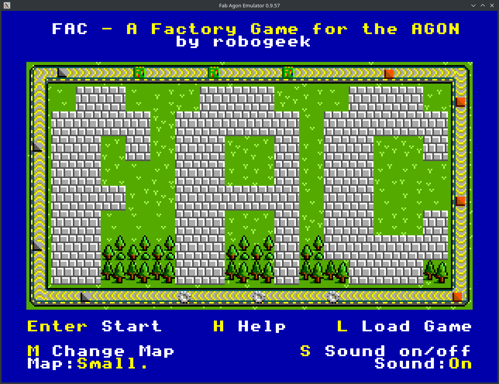

# fac
A Factory game for the Agon.

## INSTALL
run the included install.sh script to install it to an sdcard location (microSSD or emulator).
This will copy the asset directories and make a save directory for you.
Then load the "fac" binary and run it.

## GAME
FAC is a factory type game heavily inspired by Factorio.  If you have played that game you will be familiar with the game play.
The idea is you are an Engineer, crash-landed on an alien world with nothing but your wits and an amazing understanding of engineering.

The world has resources for you to find and mine.  You can turn those resources into useful items and machines.
With those machines you can manufacture ever more complex machines and goods.

In the first game you are asked to manufacture 20 Computers.  These cannot be made by hand so you will need an assembler.
But to make that you will need a whole host of other machines and furnaces.

### TIPS
- Press `H` anytime for help
- Many items can be manufactured by hand - press `G` to see the list
- Press `E` to see what is in your inventory 
- All machines need Energy to work.  This can be created globally using the Generator.
- Press `I` with the cursor over an object to see info on it. (Generators show global energy)
- Belts can be used to move items

To place an item:
- Select it from the inventory.  Then it is in your hand.  Press `Enter` to place it.
- Pressing `P` will bring the currently selected item to hand ready to place again with `Enter`.
- Don't forget to rotate machines to the correct orientation when you place them

## TODO
- SOUND
- more complex game
- more recipies
- technology tree
- Needs optimisation - belts/items movement isn't great
